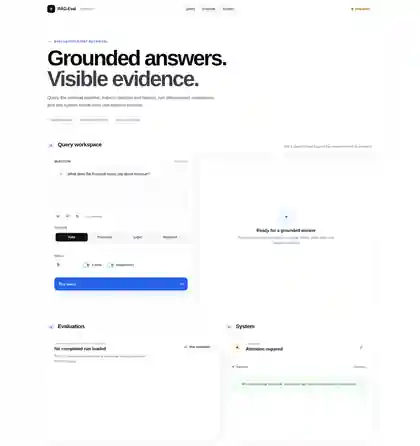
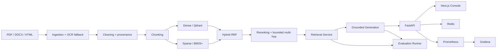

# RAG-Eval

<p align="center">
  <strong>Evaluation-first Retrieval-Augmented Generation, built as an engineering system rather than a demo.</strong>
</p>

<p align="center">
  <a href="https://github.com/sadmanHT/RagEval/actions/workflows/ci.yml"></a>
  <a href="https://github.com/sadmanHT/RagEval/actions/workflows/frontend.yml"></a>
  <a href="https://github.com/sadmanHT/RagEval/releases/tag/v0.1.0"></a>
  
  
</p>

RAG-Eval is a production-oriented RAG platform for **financial reports, legal contracts, and research documents**. It treats retrieval quality, grounding, evaluation, observability, serving, and failure recovery as first-class parts of the system.

The project combines deterministic local acceptance with real infrastructure integrations so the mechanics can be verified without inventing production-quality claims. Hosted providers remain replaceable adapters rather than hard dependencies.

<p align="center">
  
</p>

> **Portfolio review:** start with the [`engineering case study`](docs/case-study.md) for the design decisions, tradeoffs, validation strategy, and production boundaries behind the implementation.

## Why this project is different

Most RAG examples stop at “embed documents, retrieve chunks, ask an LLM.” RAG-Eval goes further:

| Area | What is implemented |
| --- | --- |
| Retrieval | Dense Qdrant retrieval, deterministic BM25/BM25+, concurrent hybrid retrieval, Reciprocal Rank Fusion, bounded query expansion, reranking, and bounded multi-hop retrieval |
| Grounding | Deterministic context assembly, canonical chunk identities, citation validation, bounded repair, and explicit insufficient-context refusal |
| Evaluation | Reviewed dataset contracts, leakage checks, context precision/recall, faithfulness, answer relevancy, hallucination accounting, resumable comparative runs, per-domain slices, regression policies, and report generation |
| Serving | Typed async FastAPI API, API-key auth, Redis cache identity/invalidation, health/readiness endpoints, streaming citations, request limits, rate limiting, and bounded evaluation jobs |
| Observability | Sanitized tracing, bounded-cardinality Prometheus metrics, provisioned Grafana dashboards, dependency readiness metrics, and outage drills |
| Product UI | Thin Next.js console for grounded queries, citations/evidence, evaluation runs, and system health without duplicating RAG logic in JavaScript |
| Delivery | Non-root Docker images, Compose stack, dependency/secret scans, frontend and backend CI, containerized end-to-end validation, and release evidence |

## Product surfaces

The frontend is intentionally thin: browser code calls same-origin Next.js route handlers, and server-side handlers attach the backend API key. Retrieval, generation, evaluation, authentication policy, and corpus logic stay in Python.

<table>
  <tr>
    <td width="50%"></td>
    <td width="50%"></td>
  </tr>
  <tr>
    <td align="center"><strong>Product console</strong><br>Query → grounded answer → citations → evaluation → system health</td>
    <td align="center"><strong>Operational dashboard</strong><br>Request rate, latency, cache, queue, provider failures, and dependency readiness</td>
  </tr>
</table>

These are captures from the running local Compose stack after the product/operational smoke path, not design mockups.

## Architecture



A core design constraint is that each phase consumes and preserves the same canonical document/chunk identities. Retrieval diagnostics, rerank decisions, context assembly, citations, evaluation records, cache identity, and traces can therefore be connected back to the same source provenance.

## What has actually been validated

RAG-Eval deliberately separates **mechanics evidence** from **representative quality evidence**.

| Evidence | Current status |
| --- | --- |
| Connected-system release scenarios | **15 / 15 passed** on the deterministic/adversarial fixture path |
| Local infrastructure | Real Qdrant + Redis exercised in integration and serving validation |
| OCR | Real local Tesseract path validated in the container tier |
| Grounding | Answerable queries preserve canonical citations; unsupported queries refuse with zero citations |
| Resumability | Evaluation checkpoints resume without re-producing completed examples |
| Recovery | Qdrant outage produces readiness degradation and dependency metrics; restart restores readiness |
| Container security | Runtime executes non-root with reduced capabilities/read-only filesystem constraints |
| Product UI | Production build, TypeScript check, dependency/secret scan, Compose smoke, and non-root frontend runtime in CI |
| Release | `v0.1.0` published from the validated release path |

The committed fixtures are intentionally small. They prove orchestration, provenance, arithmetic, failure handling, serving, observability, and release mechanics. They **do not** justify a production retrieval winner, production hallucination rate, hosted-model quality claim, or production SLO.

The target ~12,000-document representative corpus, ~200-question reviewed evaluation set, and live provider credentials are not stored in this repository and are not fabricated.

## Quick start: run the product

Requirements: Docker + Docker Compose.

```bash
git clone https://github.com/sadmanHT/RagEval.git
cd RagEval

export RAGEVAL_SERVING_API_KEY=replace-this-local-key
docker compose up -d --build qdrant redis api frontend prometheus grafana
```

Then open:

- **Product console:** http://localhost:3001
- **FastAPI / Swagger:** http://localhost:8000/docs
- **Grafana:** http://localhost:3000
- **Prometheus:** http://localhost:9090

To exercise the operational path and tear it down cleanly:

```bash
make ops-smoke
make ops-down
```

For frontend-only development, see [`docs/frontend.md`](docs/frontend.md).

## Developer setup

```bash
python -m venv .venv
source .venv/bin/activate
python -m pip install --upgrade pip
pip install -e '.[dev]'
cp .env.example .env

make verify
make integration
```

Useful validation targets:

```bash
make full-validation
make release-evaluation
make container-test
make frontend-build
```

The deterministic acceptance path can run without OpenAI/Cohere credentials. Live-provider checks are an additional validation tier.

## API surface

| Endpoint | Purpose |
| --- | --- |
| `POST /query` | Grounded query with optional domain/filter/top-k controls and retrieval diagnostics |
| `GET /health/live` | Process liveness |
| `GET /health/ready` | Dependency readiness |
| `POST /eval/run` | Submit an evaluation job |
| `GET /eval/jobs/{job_id}` | Inspect evaluation-job state |
| `GET /eval/latest` | Fetch the latest aggregate evaluation summary |
| `GET /metrics` | Prometheus metrics |

`/query` also supports NDJSON streaming while preserving a final structured citation event.

## Engineering highlights

- **Provenance-first ingestion:** normalized PDF/DOCX/HTML parsing, explicit OCR fallback, conservative cleaning, and stable source metadata.
- **Composable retrieval:** dense and sparse indexes share canonical chunk identities; RRF combines ranks instead of naïvely mixing incompatible raw scores.
- **Auditable reranking:** post-rank results preserve original dense/sparse/RRF evidence and configuration fingerprints.
- **Bounded multi-hop:** optional second-hop retrieval records each hop and reuses the same canonical indexes instead of introducing a parallel path.
- **Grounded-by-construction responses:** retrieved content is treated as untrusted context, citations must reference supplied chunk IDs, and insufficient context produces refusal rather than an ungrounded answer.
- **Evaluation as a product feature:** resumable runs, deterministic fingerprints, per-domain summaries, failure taxonomy, regression gates, local JSON tracking, optional W&B, and machine-readable reports.
- **Operational safety:** raw document/context text is never exported in traces; raw query text is off by default; metrics use bounded cardinality.
- **Security-conscious serving:** API-key authentication, body/time/concurrency limits, exact-origin CORS defaults, safe errors, security headers, and rate limiting.
- **Thin frontend boundary:** the browser never receives the FastAPI API key; the Next.js server proxies authenticated backend calls.

## Tech stack

**Backend:** Python 3.11+, FastAPI, Pydantic, Qdrant, Redis, httpx  
**Retrieval:** local/provider embeddings behind protocols, BM25/BM25+, RRF, reranking, multi-hop  
**Frontend:** Next.js 16, React 19, TypeScript  
**Observability:** Prometheus, Grafana, Langfuse-compatible tracing  
**Quality:** pytest, mypy strict mode, Ruff, pip-audit, detect-secrets  
**Runtime:** Docker, Docker Compose, non-root hardened containers

## Repository map

```text
src/rageval/        canonical Python implementation
web/                thin Next.js product console
tests/              unit + integration + operational coverage
scripts/            deterministic evidence and validation runners
ops/                Prometheus / Grafana configuration
docs/               architecture, frontend, operations, phase evidence
docker-compose.yml  local product + observability stack
```

## Documentation

- [`docs/case-study.md`](docs/case-study.md) — portfolio-oriented engineering narrative, design decisions, tradeoffs, and next steps
- [`docs/implementation-state.md`](docs/implementation-state.md) — detailed implementation and evidence state
- [`docs/architecture-decisions.md`](docs/architecture-decisions.md) — architectural decisions and constraints
- [`docs/frontend.md`](docs/frontend.md) — frontend security boundary, local development, CI, and container model
- [`docs/operations.md`](docs/operations.md) — observability, outage drills, recovery, scheduled evaluation, and security boundaries
- [`docs/phases/phase-15-report.md`](docs/phases/phase-15-report.md) — final connected-system validation and evidence limitations
- [`SECURITY.md`](SECURITY.md) — vulnerability reporting and explicit security boundaries
- [`CONTRIBUTING.md`](CONTRIBUTING.md) — contributor workflow

## Current scope and next steps

The repository is release-ready for its deterministic/local acceptance contract. The highest-value next steps are environment-specific rather than another parallel RAG implementation:

1. Validate against the representative ~12k document corpus and ~200 reviewed questions.
2. Run the hosted provider tier with real credentials and persist comparable evidence.
3. Establish production load, latency, cost, and drift baselines in the deployment environment.
4. Deploy the existing API/frontend/observability stack behind production platform controls.

## License

MIT — see [`LICENSE`](LICENSE).
